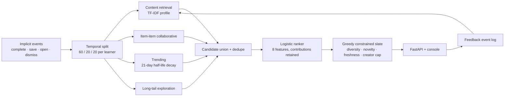

# SignalWeave

A multi-objective recommendation system for learning-content discovery, built so that every number it shows can be traced back to the computation that produced it.

Implicit feedback goes in. Four retrieval routes propose candidates, a logistic ranker orders them, and a constrained re-ranker builds the final slate against relevance, diversity, novelty, freshness and a creator cap. A FastAPI service serves it, a console explains each decision, and a check suite re-verifies the data and model claims on every run.

> **Evidence boundary.** The dataset is a deterministic synthetic simulation. Its metrics verify algorithm and product contracts. They are not claims about real users, and no offline replay of this kind can establish online causal lift.

## What this is for

Most recommender demos stop at "users who liked X also liked Y". The harder questions are the ones that decide whether a ranking policy can ship:

- Do multiple retrieval strategies actually find different candidates, or is one a duplicate of another?
- Does the ranker beat chance on data it did not fit?
- Can retrieval even reach the items the ranker is being scored on?
- What does the accuracy gain cost in coverage, novelty, diversity and creator concentration?
- Can a single recommendation explain both its ranker score and its slate position?
- Does the challenger clear a written release contract, or does it stay in shadow?

## Results

One run at seed `42`: 64 learners, 80 catalog items, 2,176 time-ordered implicit events. Each learner's stream is split 60% representation history, 20% ranker fit, 20% frozen evaluation. Everything below is recomputed at startup and written to [`artifacts/evaluation.json`](artifacts/evaluation.json).

| Policy | Role | NDCG@10 | Recall@10 | Coverage | Diversity | Creator HHI ↓ |
|---|---|---:|---:|---:|---:|---:|
| Popularity | baseline | 0.1157 | 0.1973 | 25.00% | 0.8477 | 0.1210 |
| Content | baseline | 0.2354 | 0.3548 | 98.75% | 0.7686 | 0.1245 |
| **Accuracy** | served | **0.2540** | **0.3852** | **100.00%** | 0.8166 | 0.1268 |
| Balanced | served, challenger | 0.2131 | 0.3207 | 98.75% | 0.8691 | 0.1310 |
| Discovery | served | 0.1757 | 0.2556 | 95.00% | **0.9248** | **0.1000** |

The accuracy policy — the learned ranker with light slate constraints — is the strongest on every accuracy metric and reaches the entire catalog. Balanced gives up 0.041 NDCG against it to buy higher intra-list diversity, and is the policy the release gate treats as the challenger.

Balanced improves NDCG@10 over popularity by `+0.0974`; a 500-resample paired-learner bootstrap puts the 95% interval at `[0.0202, 0.1686]`. Every guardrail passes, so the gate returns **promote to shadow** — not "ship".

Underneath the slate metrics:

| | |
|---|---:|
| Ranker, 5-fold ROC AUC on held-out folds | 0.6402 |
| Ranker, Brier score | 0.2254 |
| Fit rows after negative sampling | 842 |
| Candidate recall ceiling for the frozen window | 0.9111 |

The AUC is modest and stated plainly. The candidate-recall ceiling matters more than it looks: retrieval reaches 91% of the frozen-window positives, so ranking cannot recover the other 9% no matter how good it gets.

One number that belongs next to all the others: on seed `7` the same pipeline scores ROC AUC 0.671 and balanced NDCG@10 0.2547, against 0.6402 and 0.2131 on seed `42`. Single-seed results on 64 simulated learners carry real variance, and quoting seed 42 alone would overstate how settled any of this is. That run is registered as its own model version rather than being allowed to overwrite the canonical record.

## Checks, not assertions

`python -m signalweave.validation` re-derives every claim against the running process and prints the result. It also backs `GET /api/validation` and the console's **Checks** tab.

```bash
python -m signalweave.validation          # print the report
python -m signalweave.validation --write  # print, then refresh artifacts/
```

Current run: **31 checks — 27 pass, 0 fail, 4 known limitations**, rising to 36 once a registered model is being served, since five of them only mean something then.

A check is `pass` when the claim holds, `fail` when something is wrong, and `known` when the claim does not hold and the reason is a deliberate trade-off. The `known` verdict exists so the report never has to choose between a dishonest green board and a false alarm. The four are:

| Check | Why it does not pass |
|---|---|
| `features_vary` | `editorial quality` spans only 0.185 across the fit set — it cannot separate classes on this catalog. |
| `features_carry_weight` | `editorial quality` and `popularity` end up with coefficients near zero. Two of the eight features are along for the ride. |
| `score_is_a_probability` | `class_weight="balanced"` reweights the classes, so the mean score (0.4706) sits far above the actual positive rate (0.2340). The score orders candidates; it is not a probability. |
| `challenger_beats_strongest_baseline` | Balanced trails the content baseline by 0.0223 NDCG. The gate only compares against popularity, so it does not test for this. That is a product choice, and it is written down rather than hidden. |

What the passing checks cover: byte-identical regeneration from the seed, referential integrity, chronological ordering, an exact three-way partition with no time inversion and no item leaking from history into the frozen window, finite and bounded features, held-out ranker quality above chance, per-item explanations that sum back to the logit that produced them, retrieval routes that are not duplicates of each other, the creator cap, agreement between `artifacts/evaluation.json` and a live recomputation, and — when a registered model is loaded — that the coefficients in memory hash to the digest recorded when they were registered.

## Path a recommendation takes



## Operations

Serving loads a registered model. It does not fit one on the request path, and it does not
recompute the metrics it reports — those travelled with the model in its bundle. Full detail in
[docs/mlops.md](docs/mlops.md).

```bash
python -m signalweave.train                     # fit, evaluate, check, register, promote
python -m signalweave.train --list              # what is registered, and which is champion
python -m signalweave.train --promote VERSION   # roll forward or back
python -m signalweave                           # serve the champion
```

**Registration is gated.** The training pipeline runs all 31 checks before it writes anything, and
a run that produces a single `fail` does not become an artifact. The gate between "a model exists"
and "a model is servable" is the check suite, not someone remembering to look.

**Each version keeps a manifest** recording the data digest, the digest of the source that defined
the features, the model digest, the environment, the metrics and the check tally at training time.
The binary is gitignored; the manifest is not. A model you can rebuild is cheap. A model you cannot
account for is a liability.

**Shadow deployment acts on the gate's verdict.** The gate returns `promote_to_shadow`, so
`balanced` runs in shadow: it is scored on every champion request and never returned. Only the
divergence leaves the process — a shadow slate that reaches a user is not a shadow. On a typical
request it keeps 7 of 8 items with the same top pick, which is a more useful thing to know before
an experiment than after one.

**Three things are monitored** that the offline evaluation cannot see: per-route latency, the
population stability index of live feedback against the action mix the ranker was fitted on, and
the mean utility of served slates against the baseline recorded in the manifest. Below 30 live
events the drift report says `insufficient_data` rather than printing a PSI computed on nine
events.

Startup went from fitting a model (~4 s) to loading one (~0.2 s), which is a side effect rather
than the point. The point is that the model answering requests is a named thing you can roll back.

CI runs the tests, then the check suite, then the training pipeline. A change that moves the
metrics without regenerating `artifacts/evaluation.json` fails the build.

## The console

Five views, all fed by the API:

- **Slate** — the ranked result for one learner under one policy. Every row expands into its own decomposition: the four weighted utility terms with their shares, the eight ranker feature contributions as signed effects on the logit, which routes retrieved it, which candidate it beat and by how much, and how many candidates the creator cap removed at that position.
- **Policies** — the frozen-window matrix across all five policies, the release gate with each guardrail's threshold and observed value, the bootstrap interval, and the ranker's coefficients and held-out scores.
- **Checks** — the validation report above, rendered as claim / expected / observed / verdict.
- **Pipeline** — stages, the split contract, and the evidence boundary.
- **Operations** — which model version is loaded and what produced it, every registered version,
  accumulated shadow divergence, per-route latency, and the drift report.

Save, complete or dismiss anything in a slate: the event is written to local SQLite, folded into the learner's profile, and reflected in the next request.

## Quick start

Python 3.11+.

```powershell
git clone https://github.com/cdexswzaq0110/SignalWeave.git
cd SignalWeave
python -m venv .venv
.\.venv\Scripts\python.exe -m pip install -e ".[dev]"
.\.venv\Scripts\python.exe -m signalweave
```

```bash
git clone https://github.com/cdexswzaq0110/SignalWeave.git
cd SignalWeave
python3 -m venv .venv
.venv/bin/python -m pip install -e '.[dev]'
.venv/bin/python -m signalweave
```

Then open <http://127.0.0.1:8010>. On Windows, `scripts\run.ps1` creates the environment on first
run and starts the same service.

On a cold checkout there is no registered model, so the first start trains one and registers it.
Every start after that is a load.

## Test

```powershell
.\.venv\Scripts\python.exe -m pytest -q
```

Eleven tests: deterministic Top-K output, creator-cap enforcement, temporal evaluation guardrails,
API health and persisted feedback, explanation-reconstructs-the-score, a registry round trip that
proves a loaded model serves an identical slate, rejection of a bundle whose feature contract has
moved, champion promotion and rollback, shadow logging that never leaks the shadow slate, and a run
of the full check suite that fails the build if any check returns `fail`.

## Repository map

```text
SignalWeave/
├── src/signalweave/
│   ├── data.py             # deterministic catalog, learners, events, temporal split
│   ├── recommender.py      # retrieval, ranker, slate optimizer, evaluation
│   ├── validation.py       # the check suite behind /api/validation
│   ├── registry.py         # versioned model bundles and manifests
│   ├── train.py            # fit → evaluate → check → register, and the promote/rollback CLI
│   ├── monitoring.py       # latency, shadow comparison, drift
│   ├── api.py              # FastAPI, SQLite feedback and shadow log, operational endpoints
│   └── __main__.py         # local entry point on port 8010
├── web/                    # dependency-free console (three files, no build step)
├── tests/
├── artifacts/
│   ├── evaluation.json     # reproducible metrics
│   ├── validation.json     # reproducible check report
│   └── models/             # registry.json + one manifest per version
├── docs/
│   ├── PRD.md
│   ├── architecture.md
│   ├── api.md
│   ├── mlops.md
│   └── model-card.md
├── .github/workflows/ci.yml
├── scripts/run.ps1
└── pyproject.toml
```

## Design choices

- **Synthetic before scraped:** reproducible, privacy-safe, and honest about the ceiling on what it can prove.
- **Logistic ranker before a two-tower model:** 842 fit rows do not justify a deep model, and per-feature contributions stay auditable — the explanations shown in the UI are checked to reconstruct the logit exactly.
- **Four simple retrievers before a vector database:** 80 items fit in memory. The check that matters is whether the routes are actually different, and that is measured rather than assumed.
- **Greedy re-ranking before a solver:** the slate is small and each step's decision, including its runner-up and its margin, can be shown.
- **SQLite before a streaming platform:** feedback persistence is real; throughput is not yet a measured problem.
- **A file-backed registry before a model server:** the property worth having is that serving loads a named, digest-checked artifact instead of fitting one. That is achievable with a directory and a JSON pointer, and everything above it is packaging.

## Documentation

- [Product requirements](docs/PRD.md)
- [System architecture](docs/architecture.md)
- [API contract](docs/api.md)
- [Operations: registry, shadow, drift, CI](docs/mlops.md)
- [Model card and limitations](docs/model-card.md)
- [Shared language](CONTEXT.md) — the vocabulary this codebase commits to
- [ADR-0001](docs/adr/ADR-0001-serving-loads-a-registered-model.md) — why serving loads a registered model instead of fitting one
- [ADR-0002](docs/adr/ADR-0002-three-valued-check-verdicts.md) — why check verdicts are three-valued
- [Lessons](docs/lessons/INDEX.md) — what this build cost to learn

## Working conventions

Two rules shaped this codebase more than any design choice did.

**Every conclusion carries an evidence grade.** A number that was measured and a number that merely
sounds right do not get written the same way. That is the rule this project exists to satisfy — its
predecessor had its documentation and its code produced in the same pass, which made them agree with
each other and with nothing else.

**Every round leaves a retrievable lesson.** The two in `docs/lessons/` are what this build actually
cost to learn: how co-generated docs endorse co-generated code, and why a check needs its scope
defined alongside it.
